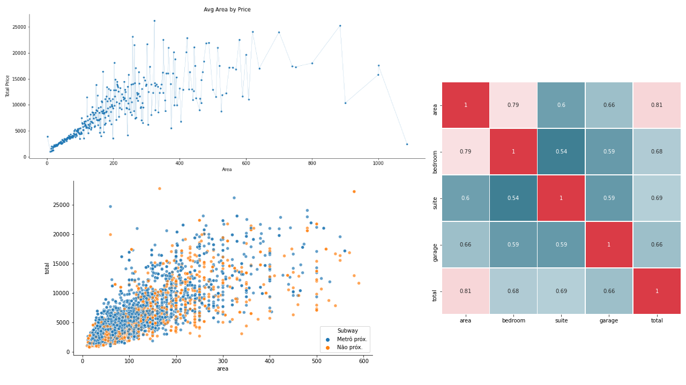
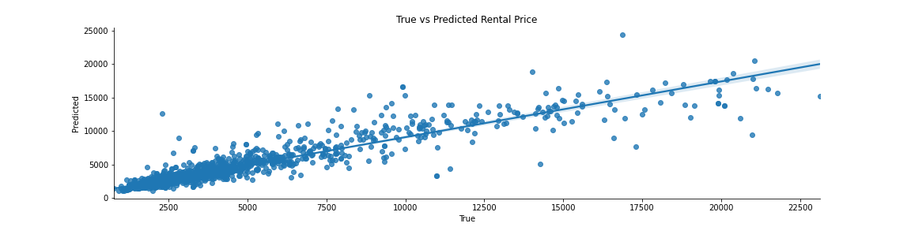

# DataScienceRentalPrice

## Description

The main goal of this project is to help on the rental process by estimating the total rent price of houses, apartments or studios. It is using real data collected from 5andar, a pretty famous rental site here in Brazil.

## Overview

* Scrapped around 14000 rental posts (in two chuncks) from 5andar using python.
* Removed duplicated and cleaned the data to make it usable to the model.
* Feature engineering and data analysis to find some patterns.
* Reduced input size data from 56 to 31 by using some feature selection.
* Created a final model with an 749 MAE (16% of error when comparing to the target mean value)

### Web Scrapping
Constructed a scrapper to collect most of the information contained on the 5andar rental posts, such as:

* Title
* Address
* Area
* Bedroom
* Garage
* Floor
* Pet
* Furniture
* Area
* Subway
* Rent
* Condominium
* Taxes
* Fire Insurance
* Services
* Total

### Data Cleaning

After the data was collected I did some cleaning to let it more usable for our model.   

* Merged the two parts of the extracted data and removed duplicates
* Removed rows with no total price, as it is the target value
* Extracted the rental type (house, apartment, studio) and district from the title column
* Removed unnecessary text from area, garage and floor
* Parsed bedroom and suite quantity from "bedroom" column
* Removed unnecessary text from all the "price" columns (rent, condominium, taxes, fire insurance, services and total)

### EDA

In this part I've tried to find some correlation between all my variables and the target (rental price).

Here are some plots generated in this part:

### Model Building

In this last part I did the following steps:

1. Transformed all my categorical variables into dummy variables.
2. Trained some regression models (Linear Regression, Decision Tree, Random Forest, XGBoost)
3. Did a feature selection using the Random Forest model
    * Selected top variables that were responsible for a 99% cumulative importance. Giving me a reduction of 40% in the number of variables (56 to 31).
4. Retrained all models using these selected variables.

When comparing those two trainings its clear that the removal of 25 features did almost no difference in the model performance.

Model | MAE Without Feature Selection |	MAE With Feature Selection
------ | ----------------------- | -------------------------
Linear Regression |	1072.248529 | 1079.178736
Decision Tree |	773.125481 | 777.398131
Random Forest |	747.179079 | 749.784003
XGBoost | 967.861749 | 971.338345

.

Below is plotted the final result using Random Forest (with feature selection)

